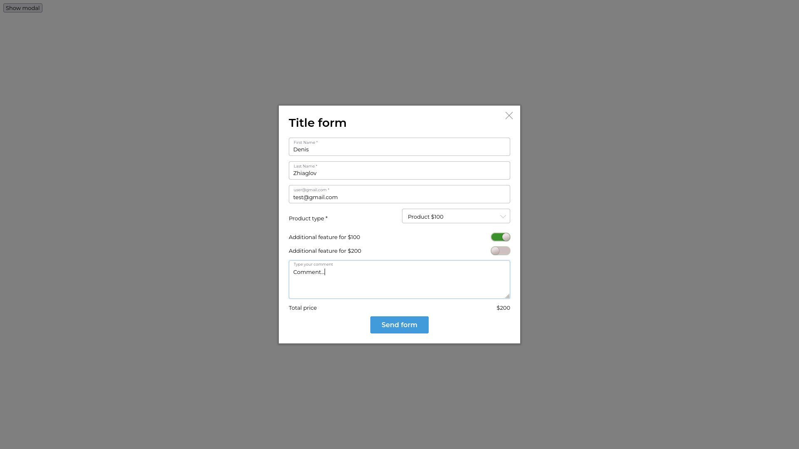
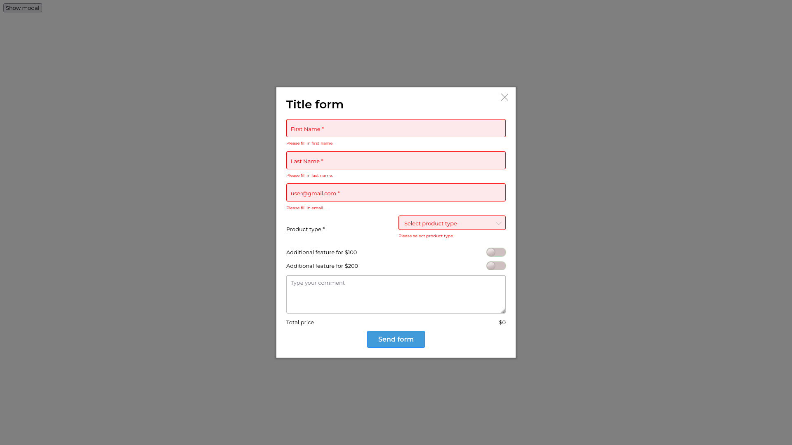
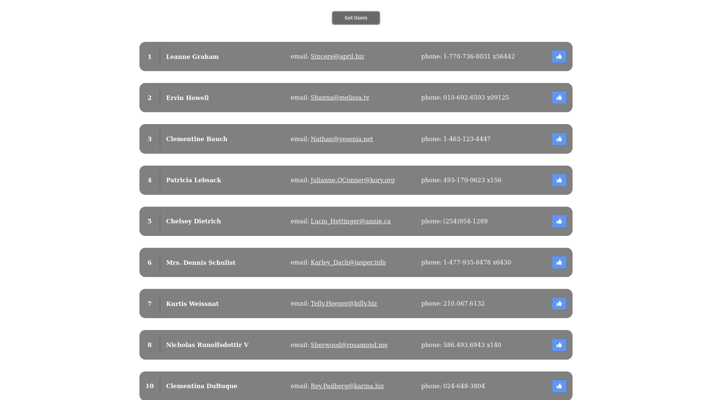
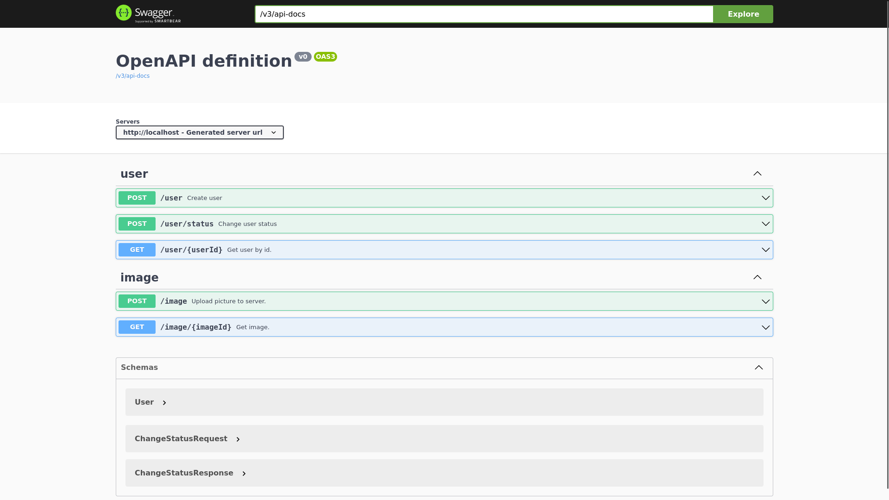

# Description

This is a test task for a Junior FullStack Developer position.
It consists of three small tasks:
- a modal html form, made according to the layout in TaskDescription.pdf
- an html page that retreives data about users from remote API
- a Spring Boot API server that stores data in a database using Spring JPA and provides swagger UI documentation

You can see video demonstration [here](https://drive.google.com/file/d/1FHL-MI99DXHCLj3xiOCbkjPGfor4E725/view).

## 1. Modal form
Try here: https://den4ick240.github.io/scrilte-test-task/light_test_task/

## 2. HTML page

Try here: https://den4ick240.github.io/scrilte-test-task/medium_test_task/

This page retreives data about users from remote API.

## 3. Spring Boot API server
Try uself using [this docker-compose file](high_test_task/docker-compose.yaml).	

This Spring Boot API server provides methods for creating and retreiving users and also changing their status. Additionaly it provides API for uploading images to server's database, which returns an internal url for the uploaded image. Server also provides full swaggerUI documentation.

